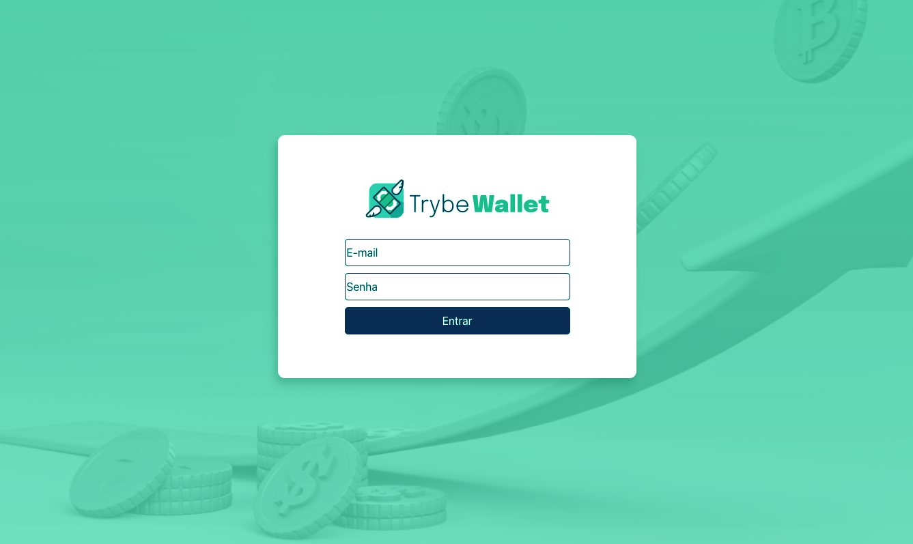
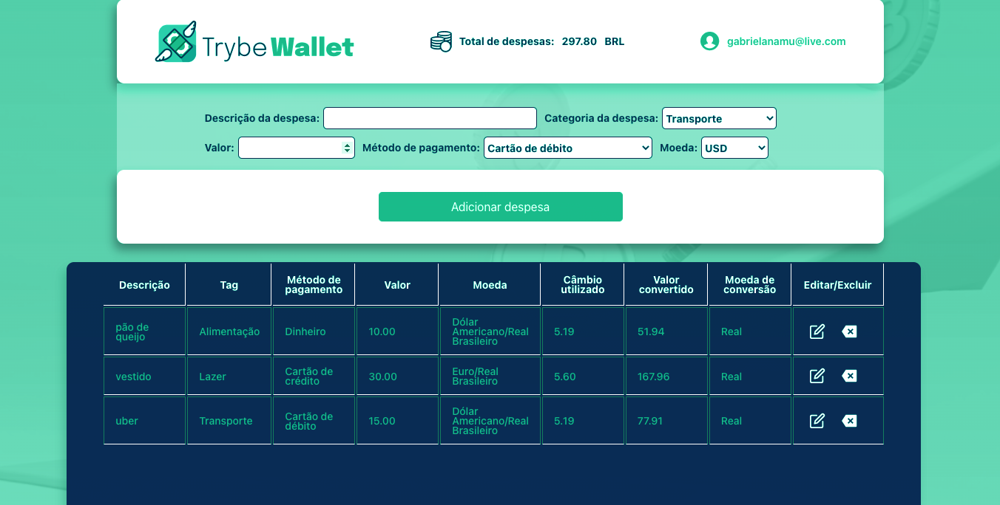

# TrybeWallet

Trybewallet is an expense control wallet with currency converter, when using this application the user will be able to:
- Add, remove and edit an expense;
- View a table with your expenses;
- View total spend converted to a currency of your choice;

<div align="center">


</div>

## How to use:
- First clone the repository into your machine;

```
 git clone git@github.com:GabiNamu/trybewallet.git
```
- After cloning, enter into the repository and install the dependencies;

```
npm install
```
- Then to see in your browser, you just need to do a npm start;
```
npm start
```

## Main technologies used:
- React;
- Redux;
- JavaScript;
- Css;


